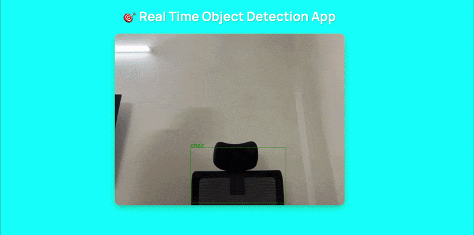

# 🎯 Real Time Object Detection App

A React-based web application that performs real-time object detection using your webcam. Built with **TensorFlow.js** and the **COCO-SSD model** for fast, accurate object recognition.

## Features

- 📹 **Real-time Webcam Feed** - Live video stream from your camera
- 🤖 **ML-Powered Detection** - Uses TensorFlow's COCO-SSD model for object detection
- 📊 **Bounding Boxes** - Visual boxes around detected objects with labels
- 🚀 **Fast Performance** - Optimized detection running at ~10 FPS (100ms intervals)
- 📱 **Responsive Design** - Works on different screen sizes
- ⚡ **Zero Configuration** - No complex setup required

## Sample Execution of this project:


## Tech Stack

- **React** 19.2.4 - UI framework
- **Vite** 8.0.4 - Build tool & dev server
- **TensorFlow.js** 4.22.0 - ML library
- **COCO-SSD** 2.2.3 - Pre-trained object detection model
- **React Webcam** 7.2.0 - Webcam integration
- **ESLint** - Code quality

## Installation

1. **Clone the repository**
   ```sh
   git clone https://github.com/yourusername/objectDetectionProject.git
   cd objectDetectionProject
   ```

2. **Install dependencies**
   ```sh
   npm install
   ```

3. **Start development server**
   ```sh
   npm run dev
   ```

4. **Open in browser**
   Navigate to `http://localhost:5173`

## Project Structure

```
src/
├── App.jsx                 # Main component
├── App.css                 # Global styles
├── main.jsx                # Entry point
├── index.css               # Root styles
├── hooks/
│   └── useObjectDetection.js    # Custom hook for ML model
├── utils/
│   ├── canvasUtils.js           # Canvas drawing utilities
│   └── detectionUtils.js        # Detection tracking logic
└── styles/
    ├── global.css
    └── components/
        ├── Title.css
        ├── AppContainer.css
        └── VideoContainer.css
```

## How It Works

1. **Model Loading** - COCO-SSD model loads on app mount
2. **Video Stream** - Webcam feed displays in real-time
3. **Detection Loop** - Model detects objects every 100ms
4. **Visualization** - Bounding boxes drawn around detected objects
5. **Tracking** - Detections are counted in the detection map

## Key Components

### `useObjectDetection` Hook
Located in [src/hooks/useObjectDetection.js](src/hooks/useObjectDetection.js)
- Manages webcam and canvas refs
- Loads TensorFlow models
- Runs detection predictions

### `drawBoundingBoxes` Utility
Located in [src/utils/canvasUtils.js](src/utils/canvasUtils.js)
- Draws rectangles around detected objects
- Labels objects with their class names
- Tracks detections

### `createDetectionTracker` Utility
Located in [src/utils/detectionUtils.js](src/utils/detectionUtils.js)
- Maintains count of detected objects
- Triggers alerts for specific detections

## Detected Objects

The COCO-SSD model can detect 90+ object types including:
- Person, cat, dog, bird
- Car, bicycle, boat, airplane
- Chair, table, bed, laptop
- And many more...

## Browser Requirements

- Modern browser with WebGL support (Chrome, Firefox, Safari, Edge)
- Webcam/camera access permission
- JavaScript enabled

## Performance

- **Detection Interval**: 100ms (10 FPS)
- **Model Size**: ~20MB (downloaded on first load)
- **Supported Resolutions**: Up to 1080p


## License

MIT

## Author

raunakbhutani
